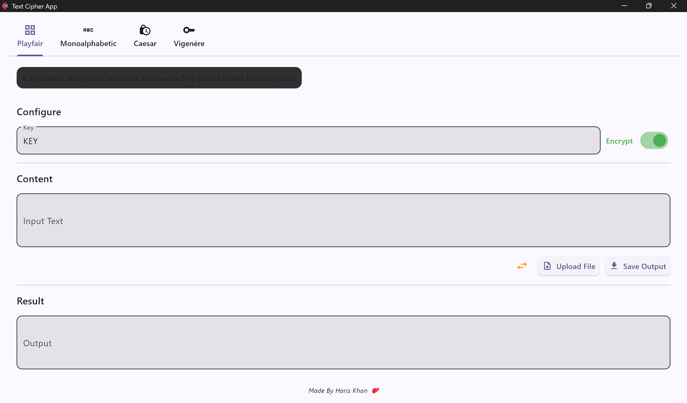
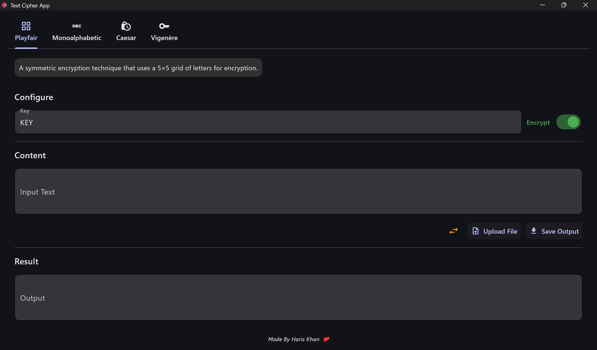

# 🔐 Text Cipher App

A sleek and modern Python GUI app for encrypting and decrypting text using classical cipher techniques. Built with the [Flet](https://flet.dev/) framework, this app combines elegant design with real-time functionality and support for multiple ciphers.

---

## ✨ Features

- 📑 **Tabbed Cipher Selection** – Switch easily between Playfair, Monoalphabetic, Caesar, and Vigenère
- 📝 **Real-Time Encryption/Decryption** – Output updates instantly as you type
- 🔑 **Animated Key Inputs** – Smooth transitions when switching ciphers
- 🌓 **Dark & Light Mode Toggle** – Personalize your experience
- 🆚 **Side-by-Side Input/Output** – Clean layout for comparing texts
- 📂 **File Upload & Save** – Work directly with `.txt` files
- 🔄 **Input/Output Swap Button** – Flip content with one click
- 🛑 **Input Validation** – Handles empty inputs and errors gracefully
- 🧽 **Highly Polished UI** – Responsive, mobile-friendly layout with icons, dividers, and consistent spacing

---

## 🧠 Supported Ciphers

- **Playfair Cipher**  
- **Monoalphabetic Cipher**  
- **Caesar Cipher**  
- **Vigenère Cipher**

Each cipher includes tooltips, descriptions, and intuitive controls.

---

## 🖥️ Screenshot Preview

| Light Mode | Dark Mode |
|------------|-----------|
|  |  |

> 💡 Screenshots go in the `screenshots/` folder — make sure to add your own!

---

## 🚀 Getting Started

### 🛠 Requirements

- Python 3.10+
- Flet library

Install Flet via pip:

```bash
pip install flet
